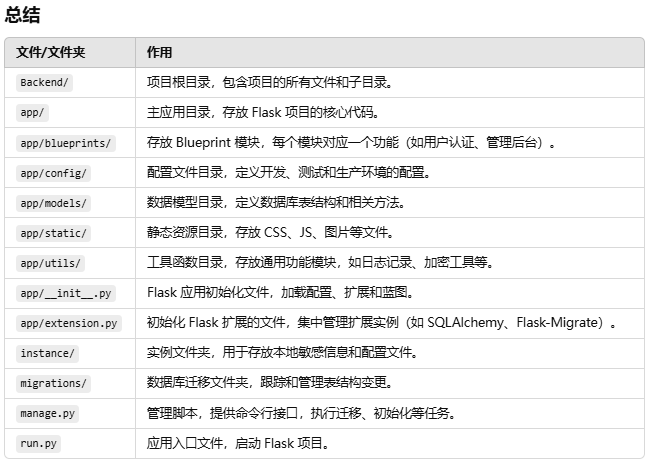

## 1. Initialize Database

```
$env:FLASK_APP = "run.py"  // Make sure environment variable
flask db init  		   // Initialize the database
flask db migrate -m "Initial migration"  // Migration database
flask db upgrade           // Upgrade database
```



